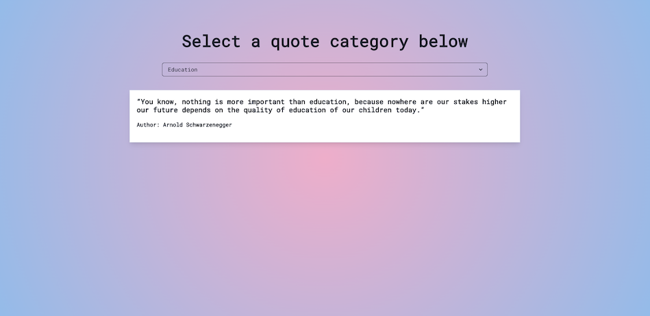
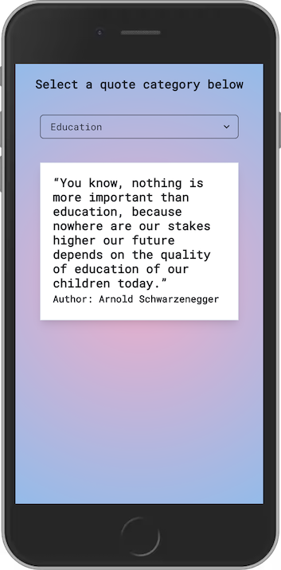

#Inspirational Random Quotes

This is a React application that displays inspirational quotes from various categories. Users can select a category from the dropdown menu and the app will display a random quote from that category.

**Screenshot**

1. Desktop

<pre></pre>

2. Mobile
   <pre></pre>
   

<pre></pre>

**Installation**

To run this project locally, you need to have Node.js installed on your system. Clone the repository and navigate to the project directory. Then run the following command to install the dependencies:

npm install

**Usage**

To start the application, run the following command:

`npm run dev`

This will start a local development server that you can access at http://localhost:5173.

**Built With**

1. React
2. Chakra UI
3. Vite

**License**

This project is licensed under the MIT License. See the [LICENSE](https://www.mit.edu/~amini/LICENSE.md) file for details.
